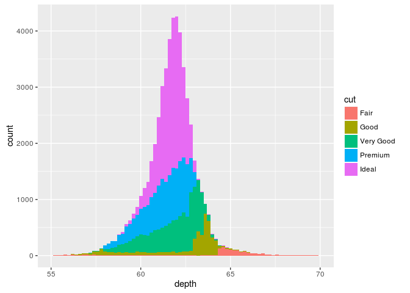
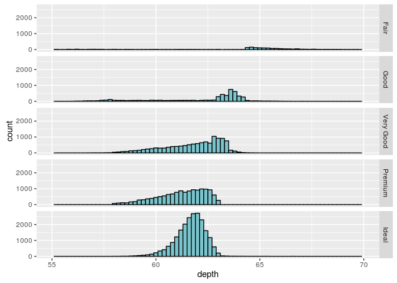
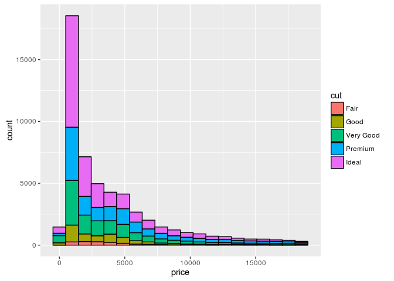
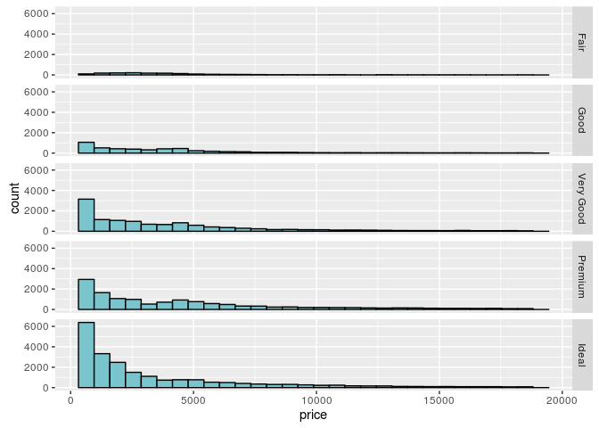
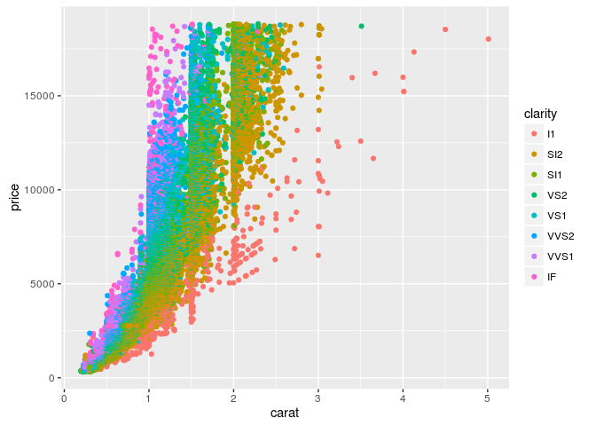

# Diamenty
Michał Buszkiewicz  
10 listopada 2016  


Krótkie podsumowanie danych:

```r
knitr::kable(summary(diamonds))
```

         carat               cut        color        clarity          depth           table           price             x                y                z        
---  ---------------  ----------------  --------  --------------  --------------  --------------  --------------  ---------------  ---------------  ---------------
     Min.   :0.2000   Fair     : 1610   D: 6775   SI1    :13065   Min.   :43.00   Min.   :43.00   Min.   :  326   Min.   : 0.000   Min.   : 0.000   Min.   : 0.000 
     1st Qu.:0.4000   Good     : 4906   E: 9797   VS2    :12258   1st Qu.:61.00   1st Qu.:56.00   1st Qu.:  950   1st Qu.: 4.710   1st Qu.: 4.720   1st Qu.: 2.910 
     Median :0.7000   Very Good:12082   F: 9542   SI2    : 9194   Median :61.80   Median :57.00   Median : 2401   Median : 5.700   Median : 5.710   Median : 3.530 
     Mean   :0.7979   Premium  :13791   G:11292   VS1    : 8171   Mean   :61.75   Mean   :57.46   Mean   : 3933   Mean   : 5.731   Mean   : 5.735   Mean   : 3.539 
     3rd Qu.:1.0400   Ideal    :21551   H: 8304   VVS2   : 5066   3rd Qu.:62.50   3rd Qu.:59.00   3rd Qu.: 5324   3rd Qu.: 6.540   3rd Qu.: 6.540   3rd Qu.: 4.040 
     Max.   :5.0100   NA                I: 5422   VVS1   : 3655   Max.   :79.00   Max.   :95.00   Max.   :18823   Max.   :10.740   Max.   :58.900   Max.   :31.800 
     NA               NA                J: 2808   (Other): 2531   NA              NA              NA              NA               NA               NA             

Histogram atrybutu "depth" (fill=cut):

```r
ggplot(diamonds, aes(depth, fill=cut)) +
  geom_histogram(binwidth = 0.2) +
  xlim(55, 70) 
```

```
## Warning: Removed 45 rows containing non-finite values (stat_bin).
```

<!-- -->

Histogram atrybutu "depth" (panele na podstawie cut):

```r
ggplot(diamonds, aes(depth)) +
  geom_histogram(binwidth = 0.2, color="black", fill = "cadetblue3") +
  facet_grid(cut ~ .) +
  xlim(55, 70) 
```

```
## Warning: Removed 45 rows containing non-finite values (stat_bin).
```

<!-- -->

Histogram atrybutu "price":

```r
ggplot(diamonds, aes(price, fill=cut)) +
  geom_histogram(bins = 20, color="black")
```

<!-- -->

Histogram atrybutu "price" (panele dla cut)

```r
ggplot(diamonds, aes(price)) +
  geom_histogram(color="black", fill = "cadetblue3") +
  facet_grid(cut ~ .)
```

```
## `stat_bin()` using `bins = 30`. Pick better value with `binwidth`.
```

<!-- -->

Relacja między zmiennymi "carat" i "price":

```r
ggplot(diamonds, aes(carat, price, color=clarity)) + geom_point()
```

<!-- -->

